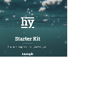

# 블로그 첫 글

테스트 입니다 잉잉


```python
import pandas as pd
```


```python
t = pd.DataFrame([[1,2], [3,4]],)
t
```


<div>
<style scoped>
    .dataframe tbody tr th:only-of-type {
        vertical-align: middle;
    }

    .dataframe tbody tr th {
        vertical-align: top;
    }

    .dataframe thead th {
        text-align: right;
    }
</style>
<table border="1" class="dataframe">
  <thead>
    <tr style="text-align: right;">
      <th></th>
      <th>0</th>
      <th>1</th>
    </tr>
  </thead>
  <tbody>
    <tr>
      <th>0</th>
      <td>1</td>
      <td>2</td>
    </tr>
    <tr>
      <th>1</th>
      <td>3</td>
      <td>4</td>
    </tr>
  </tbody>
</table>
</div>



